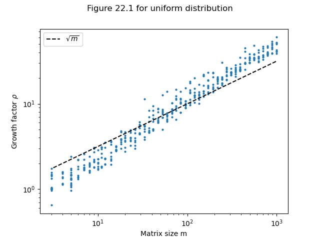
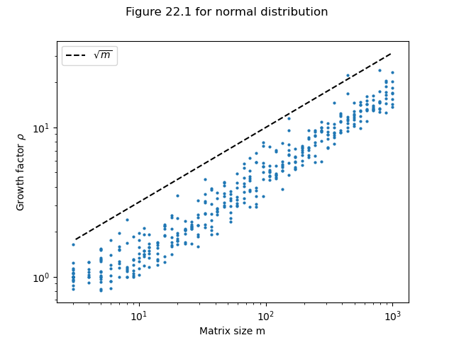
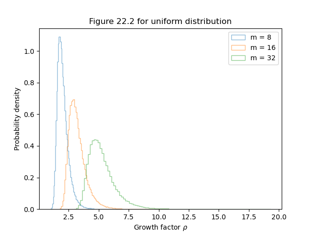
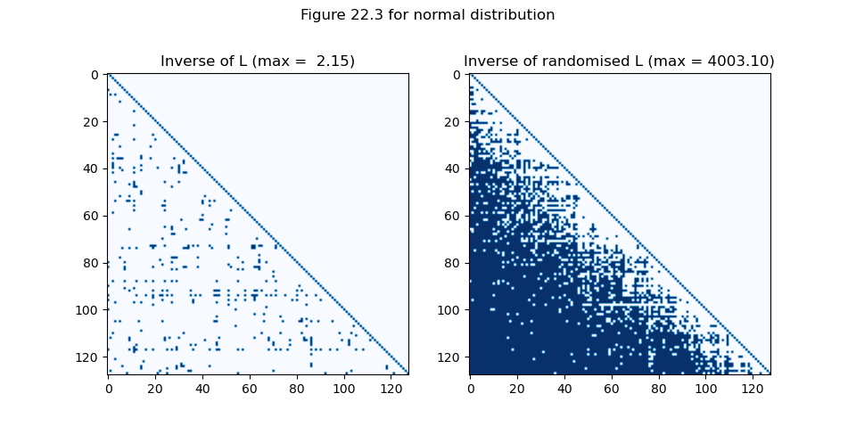
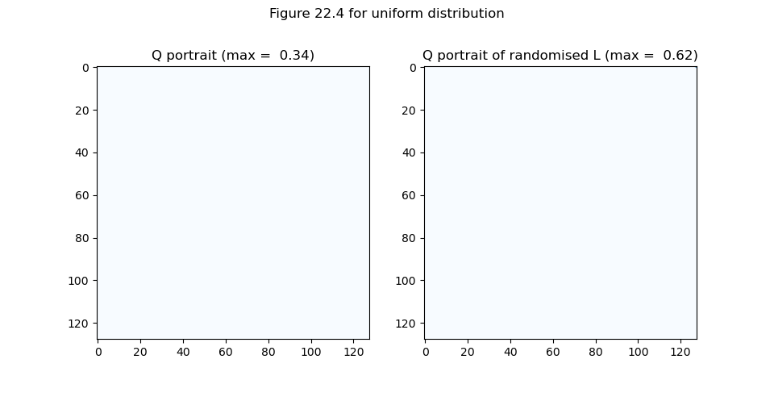
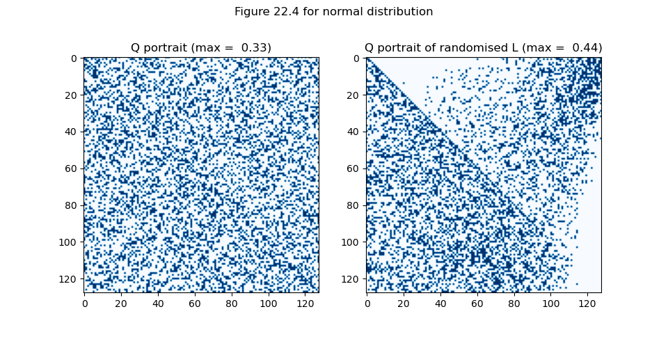
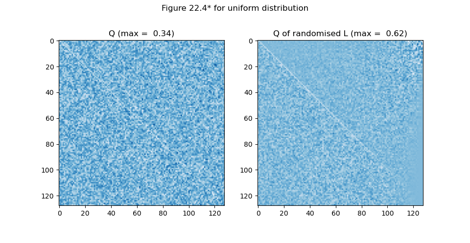

# Stability of Gaussian Elimination

We reproduce figures from *Lecture 22. Stability of 
Gaussian Elimination* of *Numerical Linear Algebra*
by Trefethen & Bau using Python.

## Figure 22.1

These figures show growth factors for Gaussian Elimination
with partial pivoting applied to 400 random matrices.

## Figure 22.2

These figures show the distributions for growth factos
of random matrices of dimensions m = 8, 16, 32, based
on sample sizes of 1e5 for each dimension.

## Figure 22.3

These figures show the inverse of L and of L with 
randomised signs in an LU factorisation.

 

# Figure 22.4

These figures show the 'Q portrait' of the factor
L and of L with randomised signs in an LU factorisation.

Note that there is almost none of entries in Q greater than
the standard deviation in the uniform case. The full matrices
without filtering is as follows:

